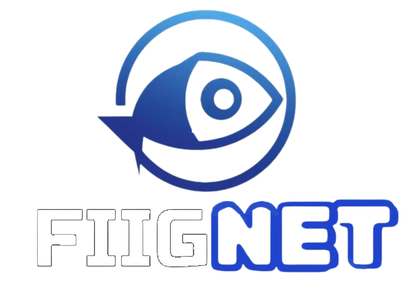

  

# Full FIIGNET Pipeline 

## Starting Requirements 
Cloning the Repo:
`git clone https://github.com/EdgarRob/FIIGNET` 

Downloads all Requirements:
`pip install -r requirements.txt` 

## Running Part 1 of Pipeline (Strong GPU Required)

### To Run the ENTIRE Part 1 Process:
1. Open `run_all.py` and change corresponding directories to your own (inputs and outputs) 
2. Run command:
`python run_all.py --(model_name)`

### Where available model names and disease types are as follows: 
Model Names:
1. GAN (NVIDIA's StyleGAN to generate more abstract fish) 
`--gan`
2. Stable Diffusion (To generate more realistic fish)
`--stable_diffusion`
3. CVAE (Conditional Variational Auto Encoder)
`--cvae`
4. FIIGNET (Fish Illness Image Generator Network)
`--fiignet`

Other Parameters:
1. If you want input image backgrounds included in final results: 
`--background`

## To Run Parts Manually: 

### Optional Datasize Inflation
If you would like to increase your dataset using data augmentation techniques, run inflate_data.py with the following code, note that scale factor should be ~ 1.0:

`make inflate input_path=/path/to/your/images brightness=(scale factor) angle=(in degrees)`

1. ### Image Resizing 
Resizes a directory of images and outputs the given specified height and width dimensions. Used to allow the YOLO model to make better decisions and normalize images before processing. Note that height and width are optional, but default is 1980x1080.

To run the command:

`make resize input_path="path_to_input" output_path="path_to_output" width="?" height="?"`

2. ### Facebook's Detectron2 for Image Segmentation
Using Facebook's Detectron2, images of fish can be detected and easily segmented to create a folder only containing pictures of the fish. Note that the model type and object being tracked may have to tinkered with to work with another (non-fish related) purpose. Note the percent confidence level to create a cropped image can be changed as well. 

Cloning the Repo:

`git clone https://github.com/facebookresearch/detectron2`

Follow the instructions in the repository and be sure to set up a virtual environment if needed. 

If you would like to change parameters or tinker with the cropping, edit `preprocessing/Detectron/detector.py`

To run the command:

`make crop input_path="path_to_input" output_path="path_to_output"`

3. ### Facebook's Segment Anything Segmentation & Masking
Using Facebook's Segment Anything Segmentation (SAM), each individual item in an image can be segmented. From here, certain algorithms and assumptions can be used to determine what in the object is the fish, and thereby allow the creation of a mask that only contains the fish portion of the image. Note that this is passed through AFTER the Detectron2 Model. Note that facebook provides checkpoint pth models, this has been mainly tested with the vit_l model. Please check the repository for more information and pip requirements. 

Cloning the Repo:

`git clone https://github.com/facebookresearch/segment-anything`

Download Pip Requirements:

`pip install git+https://github.com/facebookresearch/segment-anything.git`

`pip install opencv-python pycocotools matplotlib onnxruntime onnx`

To run the command:

`make mask input_path="path_to_input" checkpoint_path="path_to_checkpoints.pth" output_path="path_to_output"`

4. ### Image Enhancer 
Processes the image to potentially enhance the quality. Uses methods/techniques such as the gaussian filter, unsharpen mask, denoising, Savitsky-Golay filter, to try to improve any low resolution images passed through or previously segmented. 

To run the command:

`make enhance input_path="/path/to/input" output_path="/path/to/output"`

## Running Part 2 of Pipeline (Strong GPU Required)  

## Running NVIDIA StyleGAN3 Repo:   
Clone NVIDIA's StyleGAN3 Repo:

`git clone https://github.com/NVlabs/stylegan3` 

Get Package for Virtual Environment:

`pip install virtualenv`

Create the virtual environment:

`python -m venv env_name`

### 1. Activate the virtual environment:

MacOS/Unix: 

`source env_name/bin/activate`

Windows:

`.\env_name\Scripts\activate`

Install Requirements:

`pip install -r gan_requirements.txt`

### 2. Use Make Resize (Part 1) 
Be sure to Make Images Square Size and Power of 2 (For Example: 256x256, 512x512)

### 3. Creating the GAN ZIP file:
Please check the StyleGAN3 Repo for More Information.

`python dataset_tool.py --source="/path/to/input" --dest="/path/to/output.zip"`

### 4. Training the GAN with ZIP file:
To run the command:

`python train.py --outdir=~/training-runs --cfg=stylegan3-t --data=/path/to/zip/file --gpus=? --batch=? --gamma=?`

### 5. Generating Images with the Trained File:
To run the command:

`python gen_images.py --outdir=out --trunc=1 --seeds=2 --network=/path/to/trained/.pkl`

Be sure to check the training-runs directories for the results, and know that this process takes an extremely strong GPU. 

### 6. To deactivate the virtual environment:
`deactivate`

## Running InvokeAI's Stable Diffusion:   
Go to the repository website, download the pip requirements, and follow instructions up to Step 6:

`https://github.com/invoke-ai/InvokeAI/tree/main`

### To train your own model: 

1. Move into the folder:

`cd invokeai`

2. Activate the Virtual Environment:

For Linux/Mac Users:

`source .venv/bin/activate`

For Windows Users:

`.venv\Scripts\activate`

3. Take a folder of around 5 - 20 high-resolution images and move into training directory (Make sure keyword is in folder name):

`mv path/to/input/images text-inversion-training-data` 

4. Invoke the training UI:

For Linux/Mac Users:

`./invoke.sh`

For Windows Users:

`./invoke.bat`  

5. Write # 3 to Command Line 

6. Activate the InvokeAI virtual environment:

`invokeai-ti --gui`

7. Select your parameters and train. We strongly suggest stable-diffusion-1.5. 

Note that `logging_dir` may have to be changed to `project_dir` as there may be pip issues involved. 

### Using our pre-trained models: 

## Running Part 3 of Pipeline (No Strong GPU Required)

1. ### Training with Real Images or GANs 
Trains a model using FastAI to create a classification model based on how images are separated by folder in the input directory. Will train a model that can predict what type of disease a given real picture or GAN fish has.

To run the command:

`make train input_path="/path/to/input" output_path="/path/to/output"`

2. ### Predicting with Real Images or GANs 
Performs predictions using the trained model with FastAI to predict what type of disease a given real picture or GAN fish has.

To run the command:

`make predict input_image="/path/to/input/image.jpg" learner="/path/to/learner.pkl"`

# License 
This code is licensed under the MIT license.

# Project Contributors
The following contributed to the ideation and building of the pipeline (alphabetical):

Edgar Robitaille, Amish Sethi, Harley Tran, Kai Wang, Katherine Yue, Kelvin Fong

# Questions? 
Feel free to contact me with any issues/questions: erobita1@jh.edu 

